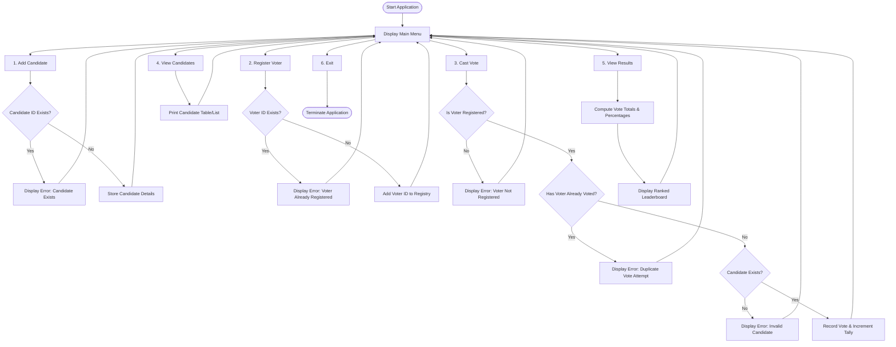

# E-Voting System

A console-based Electronic Voting System implemented in Python, designed to manage election processes such as candidate registration, voter enrollment, ballot casting, and result computation with percentage-based vote sharing.

---

## Table of Contents

- [Overview](#overview)
- [Features](#features)
- [Project Workflow](#project-workflow)
- [System Architecture & Flow](#system-architecture--flow)
- [Prerequisites](#prerequisites)
- [How to Run](#how-to-run)
- [Menu Options & Usage](#menu-options--usage)
- [Project Structure](#project-structure)
- [Future Improvements](#future-improvements)

---

## Overview

The E-Voting System is an interactive CLI application built to simulate an election process. It ensures basic election integrity by:
- Verifying candidate uniqueness.
- Ensuring only registered voters can cast a ballot.
- Enforcing single-vote-per-voter policy.
- Providing sorted election standings and percentage-based vote breakdowns.

---

## Features

- **Candidate Management**: Add candidates with unique identifiers, full names, and positions (e.g., President, Vice President).
- **Voter Registration**: Register eligible voters using distinct voter identification numbers.
- **Ballot Casting**: Secure voting mechanism that validates voter registration, checks against duplicate voting, and verifies candidate existence before recording a vote.
- **Candidate Directory**: View registered candidates alongside their respective positions.
- **Result Computation**: Tabulate votes, calculate percentage shares for each candidate, display total votes cast, and sort candidates by rank.

---

## Project Workflow

The project follows a standard four-phase election lifecycle:



### Detailed Step-by-Step Workflow

1. **Initialization Phase**:
   - The application initializes the in-memory data stores for candidates, voter registrations, and vote records.

2. **Candidate Onboarding**:
   - Election administrators add candidates by specifying an ID, name, and position.
   - The system validates that the candidate ID has not been previously registered.

3. **Voter Registration**:
   - Eligible voters register by entering their voter ID and name.
   - The system checks against duplicate voter IDs and adds valid entries to the registry.

4. **Voting Phase**:
   - Voters authenticate using their voter ID and choose a candidate ID.
   - The system performs a three-tier validation check:
     - Is the voter registered?
     - Has the voter already cast a vote in the current session?
     - Does the selected candidate exist?
   - If all validation checks pass, the vote is recorded and the candidate's tally is updated.

5. **Tallying & Result Declaration**:
   - Results can be computed and viewed at any time.
   - The system calculates total votes cast and determines each candidate's vote share percentage.
   - Candidates are sorted in descending order of vote counts to determine the winner.

---

## Prerequisites

- Python 3.7 or higher installed on your system.
- Standard Python libraries (`json`, `datetime` - built-in, no external dependencies required).

---

## How to Run

1. Clone the repository (or navigate to the project directory):
   ```bash
   git clone https://github.com/namaysingh3925/evoting.git
   cd evoting
   ```

2. Run the voting system script:
   ```bash
   python voting_system.py
   ```

---

## Menu Options & Usage

Upon running the script, the following interactive menu will be displayed:

```text
OPTIONS:
1. Add Candidate
2. Register Voter
3. Cast Vote
4. View Candidates
5. View Results
6. Exit
```

| Option | Action | Input Parameters |
|---|---|---|
| `1` | Add Candidate | Candidate ID, Candidate Name, Position |
| `2` | Register Voter | Voter ID, Voter Name |
| `3` | Cast Vote | Voter ID, Candidate ID |
| `4` | View Candidates | None |
| `5` | View Results | None |
| `6` | Exit | None |

---

## Project Structure

```text
evoting/
├── README.md           # Project documentation and workflow guide
└── voting_system.py    # Main Python script containing system logic and CLI
```

---

## Future Improvements

- Persistent storage support (SQLite / PostgreSQL / JSON file storage).
- Multi-position ballot support (e.g., voting separately for President, Secretary, Treasurer).
- Password or OTP-based voter authentication.
- Web or graphical user interface (GUI).
- Cryptographic verification / audit logs for tamper-evident vote records.
